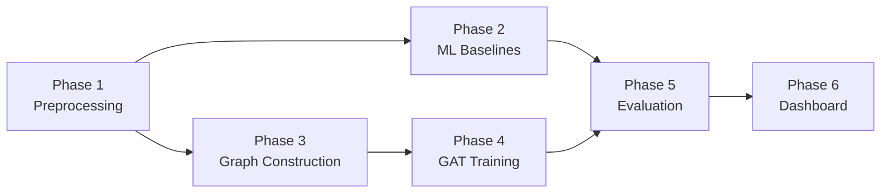

# GNN-Based Network Intrusion Detection System

Build a complete Graph Neural Network intrusion detection pipeline that models CICIDS2017 network traffic as a graph (IPs → nodes, flows → edges), classifies attacks using a GAT model, and compares against traditional ML baselines.

## Dataset Summary (from research)

| Property | Value |
|----------|-------|
| Dataset | CICIDS2017 — Friday capture (cleaned) |
| Rows | **547,555** flows |
| Columns | **86** (84 numeric features + Label + Attempted Category) |
| Unique IPs (nodes) | **8,330** |
| Unique IP pairs (edges) | **17,730** |
| Source IPs | 27 |
| Destination IPs | 8,326 |

**Label distribution:**

| Label | Count | % |
|-------|-------|---|
| BENIGN | 288,542 | 52.7% |
| Portscan | 159,066 | 29.1% |
| DDoS | 95,144 | 17.4% |
| Botnet - Attempted | 4,067 | 0.7% |
| Botnet | 736 | 0.1% |

> [!IMPORTANT]
> The dataset is **heavily imbalanced** — Botnet is only 0.1% of flows. We'll use class weighting and stratified splits to handle this.

---

## User Review Required

> [!IMPORTANT]
> **Multi-class vs. Binary classification**: The plan implements **5-class classification** (BENIGN, Portscan, DDoS, Botnet - Attempted, Botnet). Alternatively, we could merge Botnet classes and/or do binary (benign vs. attack). Which do you prefer?

> [!IMPORTANT]
> **Graph modeling approach**: We'll use **edge-level classification** — each network flow is an edge in the graph, and we classify edges as attack types. This is the most natural mapping since labels are per-flow. The GAT learns rich node embeddings from the graph structure, which are then combined with edge features to classify each flow. Does this approach sound right?

---

## Open Questions

> [!NOTE]
> **"Botnet - Attempted" label**: Should this be merged with "Botnet" into a single class, or kept separate? Merging would give ~4,800 Botnet samples instead of 736.

---

## Proposed Changes

### Phase 1: Advanced Preprocessing

#### [MODIFY] [feature_selection.py](file:///c:/Users/soham/Downloads/ISI%20Project/src/preprocessing/feature_selection.py)
- Implement real feature selection using variance thresholding and correlation analysis
- Remove near-zero variance features and highly correlated feature pairs (>0.95)
- Return selected feature names and transformed data

#### [NEW] [prepare_data.py](file:///c:/Users/soham/Downloads/ISI%20Project/src/preprocessing/prepare_data.py)
The **main preprocessing pipeline** that produces ML-ready data:
1. Load `friday_clean.csv`
2. Drop non-feature columns (`Timestamp`, `Attempted Category`)
3. Handle infinities → replace with column max
4. Handle remaining NaN → fill with 0
5. Encode labels: `LabelEncoder` → 5 classes (0-4)
6. Feature selection via `feature_selection.py`
7. Normalize features: `StandardScaler`
8. Stratified train/test split (80/20)
9. Save processed arrays to `data/processed/` as `.npy` files:
   - `X_train.npy`, `X_test.npy`, `y_train.npy`, `y_test.npy`
   - `feature_names.npy`, `label_encoder.pkl`
10. Also preserve `Src IP dec` and `Dst IP dec` columns for graph construction:
   - `ip_train.npy`, `ip_test.npy` (2-column arrays of [src_ip, dst_ip])

---

### Phase 2: Traditional ML Baselines

#### [MODIFY] [random_forest.py](file:///c:/Users/soham/Downloads/ISI%20Project/src/models/random_forest.py)
- Enhance with class weighting (`class_weight='balanced'`)
- Add hyperparameters: `n_estimators=200`, `max_depth=20`, `n_jobs=-1`
- Save trained model with `joblib`

#### [MODIFY] [xgboost_model.py](file:///c:/Users/soham/Downloads/ISI%20Project/src/models/xgboost_model.py)
- Implement full XGBoost multi-class classification
- Use `XGBClassifier` with `objective='multi:softprob'`
- Apply sample weights for class imbalance
- Save trained model

#### [NEW] [train_baselines.py](file:///c:/Users/soham/Downloads/ISI%20Project/src/models/train_baselines.py)
- Orchestrator script that:
  1. Loads preprocessed `.npy` data
  2. Trains Random Forest → saves model + predictions
  3. Trains XGBoost → saves model + predictions
  4. Prints quick metric summary for both

---

### Phase 3: Graph Construction

This is the core novelty. We model the network as a **heterogeneous communication graph**.

#### [MODIFY] [build_graph.py](file:///c:/Users/soham/Downloads/ISI%20Project/src/graph/build_graph.py)
Build a PyTorch Geometric `Data` object:
1. **Nodes** (8,330): Each unique IP address becomes a node. Map IPs to integer indices 0..N-1.
2. **Edges**: Each flow becomes a directed edge `(src_ip_idx, dst_ip_idx)`. Multiple flows between the same pair create parallel edges → store as `edge_index` of shape `[2, num_flows]`.
3. Construct separate `Data` objects for train and test splits.
4. Save the IP-to-index mapping.

#### [MODIFY] [node_features.py](file:///c:/Users/soham/Downloads/ISI%20Project/src/graph/node_features.py)
Compute **per-IP aggregated features** to characterize each node's behavior:
- **Traffic volume**: total flows in/out, total bytes in/out, total packets in/out
- **Port diversity**: unique destination ports contacted, unique source ports used
- **Protocol mix**: fraction of TCP/UDP/ICMP flows
- **Temporal**: mean/std of flow duration for flows involving this IP
- **Packet stats**: mean packet size, mean flow bytes/s across all flows
- Result: feature matrix of shape `[num_nodes, num_node_features]` (~15-20 features per node)

#### [MODIFY] [edge_features.py](file:///c:/Users/soham/Downloads/ISI%20Project/src/graph/edge_features.py)
- Each edge retains the **original flow-level features** from the dataset (post feature selection and scaling)
- Result: feature matrix of shape `[num_edges, num_edge_features]`
- This is essentially `X_train` / `X_test` reordered to match edge ordering

#### [NEW] [build_pyg_data.py](file:///c:/Users/soham/Downloads/ISI%20Project/src/graph/build_pyg_data.py)
Orchestrator that combines everything into final `Data` objects:
1. Load preprocessed data + IP columns
2. Call `build_graph()` → node mapping + edge_index
3. Call `compute_node_features()` → node feature matrix
4. Call `compute_edge_features()` → edge feature matrix
5. Attach edge labels (y) from the original labels
6. Save `train_data.pt` and `test_data.pt`

---

### Phase 4: GAT Model & Training

#### [MODIFY] [gat_model.py](file:///c:/Users/soham/Downloads/ISI%20Project/src/models/gat_model.py)
Define a **GAT-based edge classifier**:

```
Architecture:
┌─────────────────────────────────┐
│  Node Features [N, F_node]      │
│           ↓                     │
│  GATConv Layer 1 (8 heads)      │
│  → BatchNorm → ELU → Dropout   │
│           ↓                     │
│  GATConv Layer 2 (4 heads)      │
│  → BatchNorm → ELU → Dropout   │
│           ↓                     │
│  Node Embeddings [N, D]         │
│           ↓                     │
│  Edge Classification Head:      │
│  concat(src_emb, dst_emb,       │
│         edge_features)          │
│           ↓                     │
│  MLP: Linear → ReLU → Dropout  │
│       → Linear → 5 classes     │
└─────────────────────────────────┘
```

- Input: node features + edge_index + edge features
- GAT layers learn node representations via attention over neighbors
- Edge classifier concatenates source + destination node embeddings + edge features
- MLP head produces 5-class logits

#### [MODIFY] [train_gat.py](file:///c:/Users/soham/Downloads/ISI%20Project/src/models/train_gat.py)
Full training pipeline:
1. Load `train_data.pt` and `test_data.pt`
2. Compute class weights from training label distribution
3. Training loop:
   - Optimizer: Adam, lr=0.001, weight_decay=5e-4
   - Loss: `CrossEntropyLoss` with class weights
   - Epochs: 100 (with early stopping, patience=10)
   - Log train loss, train accuracy, val accuracy per epoch
4. Evaluate on test set → save predictions
5. Save best model checkpoint

---

### Phase 5: Evaluation & Comparison

#### [MODIFY] [metrics.py](file:///c:/Users/soham/Downloads/ISI%20Project/src/evaluation/metrics.py)
- Extend to multi-class: weighted precision, recall, F1, accuracy
- Per-class metrics breakdown
- Return results as a structured dict

#### [MODIFY] [confusion_matrix.py](file:///c:/Users/soham/Downloads/ISI%20Project/src/evaluation/confusion_matrix.py)
- Implement using `sklearn.metrics.confusion_matrix` + `seaborn.heatmap`
- Generate and save confusion matrix plots for each model
- Normalize option (show percentages)

#### [MODIFY] [roc_analysis.py](file:///c:/Users/soham/Downloads/ISI%20Project/src/evaluation/roc_analysis.py)
- Compute one-vs-rest ROC curves for each class
- Calculate per-class AUC and macro-average AUC
- Plot and save ROC curve figures

#### [NEW] [compare_models.py](file:///c:/Users/soham/Downloads/ISI%20Project/src/evaluation/compare_models.py)
- Load predictions from all 3 models (RF, XGBoost, GAT)
- Generate comparison table (accuracy, precision, recall, F1, AUC per model)
- Generate comparative bar charts
- Save results to `reports/model_comparison.csv` and `reports/comparison_chart.png`

---

### Phase 6: Flask Dashboard

#### [MODIFY] [app.py](file:///c:/Users/soham/Downloads/ISI%20Project/src/dashboard/app.py)
Build a multi-page Flask dashboard:
- **Home**: Project overview + dataset stats
- **Graph Visualization**: Interactive network graph (subset) using vis.js or Plotly
- **Model Results**: Comparison table + charts
- **Confusion Matrices**: Side-by-side for all models
- **ROC Curves**: Interactive plot
- Serve static assets (generated plots) from `reports/`

#### [NEW] [templates/](file:///c:/Users/soham/Downloads/ISI%20Project/src/dashboard/templates/)
- `base.html` — layout template with navigation
- `home.html`, `graph.html`, `results.html`, `confusion.html`, `roc.html`

#### [NEW] [static/](file:///c:/Users/soham/Downloads/ISI%20Project/src/dashboard/static/)
- CSS styles for the dashboard

---

## Verification Plan

### Automated Tests
```bash
# Phase 1: Verify preprocessing output
python src/preprocessing/prepare_data.py
# → Check .npy files exist and shapes are correct

# Phase 2: Train and evaluate baselines
python src/models/train_baselines.py
# → Print RF and XGBoost metrics

# Phase 3: Build graph
python src/graph/build_pyg_data.py
# → Check train_data.pt and test_data.pt

# Phase 4: Train GAT
python src/models/train_gat.py
# → Training logs + saved model

# Phase 5: Compare all models
python src/evaluation/compare_models.py
# → Comparison table + plots

# Phase 6: Run dashboard
python -c "from src.dashboard.app import create_app; create_app().run(debug=True)"
```

### Manual Verification
- Verify confusion matrices look reasonable (diagonal-dominant)
- Verify ROC curves show expected AUC ranges
- Check dashboard renders correctly in browser
- Ensure GAT model converges (loss decreasing over epochs)

---

## Execution Order



Phases 2 and 3 can run in parallel after Phase 1 completes.
